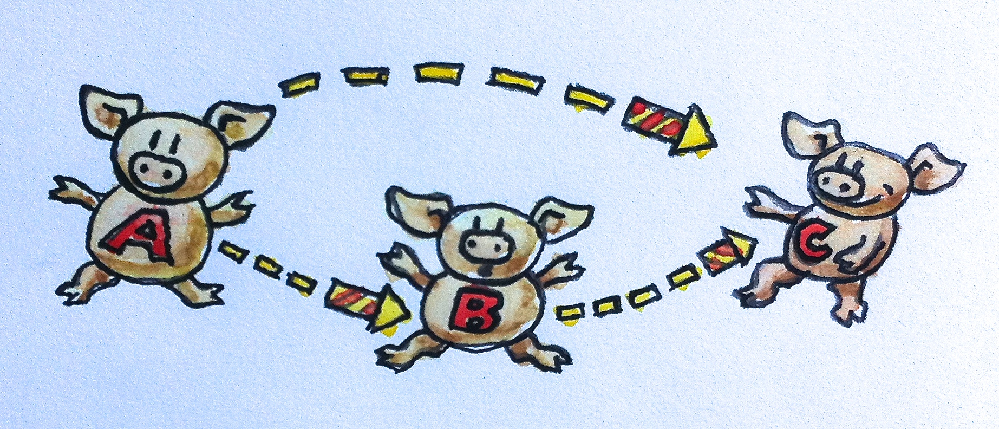

# 范畴：组合的本质

> ”读者对序言部分的热烈回应，让我有点不知所措，同时也让我有点惶恐，毕竟大家对我寄予了很高的期望。恐怕无论我写什么，可能都无法让所有读者满意，一些读者希望这本书更加贴近实战，另一些读者可能更偏向理论部分；一些人讨厌C++希望所有示例都采用Haskell，而另一些则讨厌Haskell更希望采用Java。同时本书的节奏可能对一些人来说慢了，对另一些人来说则快了。因此，我想这不是一本完美的书，这是一本各方面权衡的书，主要希望能将我的一些顿悟的体会分享给所有读者。让我们从基础开始把。“
>

范畴是一个简单到令人发指的概念，一个范畴由对象和指向对象们的箭头组成。这就是为什么范畴可以很形象化表示的原因。一个对象可以使用一个小圆圈或者点表示，箭头…就用箭头表示好啦（为了有所区别，我随意画了一张示意图，用小猪表示对象，用烟花表示箭头）。但是本质上范畴就是组合，如果你喜欢，也可以认为组合的本质就是范畴。箭头也可以组合，假设有一个箭头从对象A出发指向对象B，另一个箭头则从对象B出发指向对象C，这时必须要有第三个箭头——前两个箭头的组合——从A出发指向C。

<div align=center>

</div>

## 箭头即函数
是不是感觉这些抽象的概念太乏味了？别急，让我们来探讨些具体的。箭头也就是态射，让我们把箭头当作函数，假如你有一个函数f，它接受一个类型为A的参数并返回一个B；而另一个函数g则接受一个B作为参数并返回一个C，你可以将它们组合起来，将函数f的结果传递个函数g，这样你就得到论一个新的函数，接受一个A返回一个C。

在数学上，这种组合关系用一个小圆圈来表示：g∘f。值得注意的是这里的顺序是从右到左，有些人可能会对这个反常的顺序很疑惑，因为你们熟悉的Unix管道符号像这样：`lsof | grep Chrome`，或者F#中>> 符号，它们都是从左到右的一个顺序。但是在数学里以及Haskell里的函数组合都是从右到左，为了方便理解 g∘f 可以读作“先f后g”。

通过C代码能更好地帮助我们理解这种形式。函数f，其参数类型为A，返回值类型为B，定义如下：`B f(A a);`同理另一个函数g：`C g(B b);`则它们的组合：
```c
C g_after_f(A a) {
  return g(f(a));
}
```

至此，我们使用C语言完成了从右到左的组合函数：`g(f(a))`

我多么希望C++标准库有关于两个函数组合的模版，但是很可惜并没有。既然如此，那就让我们来试试Haskell。在Haskhell里，函数f定义如下：`f:: A -> B`，同样地：`g:: B -> C`，组合后是这样的：`g.f`

一旦你认识到Haskell是如此地简单，而使用C++却无法简单明了地表达函数概念时，多少会令人唏嘘。实际上，Haskell甚至允许使用Unicode字符，所以组合可以写成这样子：`g ∘ f`，冒号和箭头符号也可以是Unicode的形式：`f ∷ A → B`

以上就是我们学习Haskell的第一课：双冒号表示“具有什么的类型”，函数类型通过箭头进行分隔。通过句点（或者Unicode小圆圈）来组合两个函数。

## 组合的性质
任何范畴都需要满足如下两条重要的性质：
1. 组合即是满足结合律的。假设有三个态射：f、g和h，它们可以进行组合（也就是它们的对象可以进行端到端的匹配），并不需要使用括号来强调组合。在数学上表示如下：
`h∘(g∘f) = (h∘g)∘f = h∘g∘f`
（伪）Haskell代码表示如下：
```haskell
f :: A -> B
g :: B -> C
h :: C -> D
h . (g . f) == (h . g) . f == h . g . f
```
（之所以说是“伪”代码，是因为Haskell并没有对函数定义相等运算）
结合律对函数来讲是显而易见的，但是对其他态射就不一定了。

2. 对于任意对象A存在一个单位组合，即箭头从对象A出发指向对象A自身。对象A的单位箭头记作idA（A上的单位箭头）。用数学符号表示函数f从A到B：
`f∘idA = f`
同样的从B到A：
`idB∘f = f`
对于函数而言，单位箭头表示仅返回参数的单位函数，对每种类型均是如此，这意味着单位函数是普遍多态的。在C++中使用模板可以定义如下函数：
`template<class T> T id(T x) { return x; }`

当然在C++里没有这么简单，因为除了关心传递什么你必须还要考虑如何传递（通过传值、传引用、传const引用、或者移动语义等）

在Haskell中，单位函数是标准库的一部分（称为序言）。其声明和定义如下：
```haskell
id :: a -> a
id x = x
```

如你所见，在Haskell中函数的多态是如此的简单。声明的时候，只需要将类型替换成类型变量，这里有个小技巧，Haskell中的类型总是大写字母打头，而类型变量则是小写字母打头。所以 `a` 表示任意类型。

Haskell的函数定义由函数名及其跟随的形式化参数组成，如示例中唯一的参数 `x` ，紧随等于符号则是函数体。这样简洁的语法通常令新手感到惊叹，但不久就会发现这样做的意义。函数定义和函数调用是函数编程中的面包和黄油，所以它们的语法必须保持短小精悍。相比于C++，Haskell不仅无需使用括号包裹参数列表，甚至也必使用逗号分割参数（你将很块看到多参数函数是如何定义的）。

函数体总是作为一个表达式——在Haskell中函数里没有语句的概念，函数的结果就是该表达式——示例中即为 `x`
让我们来总结下学习Haskell的第二堂课。
恒等条件可以这样描述（再一次地使用伪Haskell代码）：
```haskell
f . id == f
id . f == f
```
你可能会疑惑：为什么一个函数和单位函数组合不会发生产生任何作用？以及，为什么我们需要数值0呢？0表示空，是表示无的符号。古罗马有一套数值系统，并不包含0，但他们依然成就了条条大道通罗马，部分大道保留至今。

在与符号变量作用时，自然数0或者id函数相当有用。这就是为何罗马人不擅长代数的原因，相对比的，阿拉伯人和波斯人对零的概念很熟悉。因此单位函数很方便地作为高阶函数的参数或者返回值，高阶函数使得将符号作用于函数称为可能，即代数函数。

总结一下：范畴由对象及箭头（态射）组成，箭头可以进行组合，这种组合是满足交换律的。每个对象都有单位箭头作为组合的单位元。

## 组合就是编程的本质
函数式编程解决问题的方式有些奇特，他们常以带点禅宗意味的思考作为开始。例如当设计一个交互式程序时，他们会问：交互是什么？当实现康威声明游戏时，他们可能会沉思生命的意义。在这种思考下，我不由发问：编程是什么？从最基本的层次看，编程就是告诉电脑去做什么，如：“将地址x的内容加上寄存器中内容”。但即使我们使用汇编语言进行编程，我们给计算机发送的指令也比指令本身看起来更有意义。我们编程是为了解决有意义的问题（如果是没有意义的，也就不需要计算机的帮助了），但我们该怎样解决问题呢？我们通常将一个大的问题拆解成若干小的问题，如果小的问题依然很大，那么继续进行拆解，如此循环往复，最终我们通过编程逐个解决小问题从而达到解决大问题的目的。这样编程的本质就跃然纸上了：通过将代码片段进行组合形成解决大问题的方案。如果不将小问题的解决方案整合，那么对大问题的拆解将变得没有意义。

这种分而治之的过程不是计算机强加给我们的，这是出于人类自身思维的局限性，因为我们的大脑一次只能处理很小的问题。心理学引用最多的论文之一 [The Magical Number Seven, Plus or Minus Two](http://en.wikipedia.org/wiki/The_Magical_Number_Seven,_Plus_or_Minus_Two) 揭示了我们大脑只能维持7个左右的信息块。我们可能会对人类短期记忆的细节会有新的认识，但是它是有限的这一点是肯定的。一个明显的表现就是，我们没办法处理像汤水一样的对象或者意大利面式的代码，我们需要清晰的结构不仅是因为良好的结构直观好看，更是因为我们的大脑更擅长处理结构化的东西。我们经常感叹某些代码片段很优雅、很漂亮，但我们其实想表达的是对我们大脑很受用。优雅的代码使用合适大小、合适数量的块构建，让我们的大脑更容易吸收消化。

那么在组合编程中如何确定合适的块呢？表面积必须比体积增长要慢（我喜欢这个类比，因为直觉上，立方体的表面积增长速率为平方，而体积增长为立方），表面积是我们组合块所需要的信息，体积则是我们实现它们所需的信息。简而言之，一旦一个块被实现，我们可以忽略其内部细节而只用专注与其他块的交互即可。在面向对象编程中，表面就是对象的类定义，或者抽象接口；在函数式编程中，表面就是函数声明。（我简化了一些细节，但这就是我想表达的要点）

范畴在某些意义上是极端的，它极力阻止我们窥探对象的内部。对象在范畴论里是一个抽象模糊的实体，你所有能知道的仅限于对象之间的关系— 对象是如何通过箭头相联系的。这就是互联网搜索引擎通过分析内链和外链的关系来进行网站排名的方式（他们作弊时除外）。面向对象编程中，一个理想的对象只能通过它的抽象接口（纯表面积，没有体积）访问，其方法则扮演这箭头的角色。当你需要深挖对象的实现细节才能理解与其他对象组合方式时，这种编程范式已经不适合你了。

## 实战

1. 用你喜欢的编程语言尽可能实现单位函数（非Haskell语言）
2. 用你最喜欢的语言实现函数的组合，要求以两个函数作为参数，返回他们的组合
3. 写一个测试程序测试你的组合函数能否和单位函数作用
4. 万维网是某种意义上的范畴吗？超链接是态射吗？
5. Facebook是范畴吗？用户是对象吗？好友关系是态射吗？
6. 什么时候有向图是范畴？
