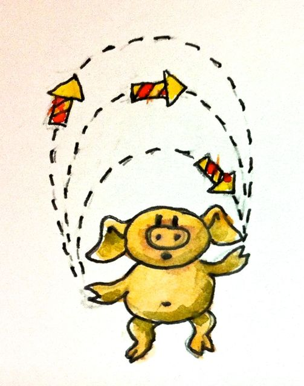
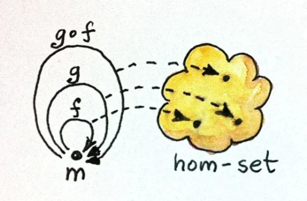

# 大范畴小范畴

通过研究各种各样的例子，你可以真正地认识范畴。范畴各种形态和大小，并且经常在意想不到的地方出现。先从一些非常简单的开始。

# 没有对象

最简单的范畴没有对象，并且相应地没有态射。对它自己来说这令人伤心，但这样的范畴在其他范畴的上下文里是非常重要的存在，例如，对于所有范畴的范畴。你如果认为空集有意义，那么空范畴为什么不能有意义呢？

# 简单图

通过箭头连接对象你就可以构建出图，可以想象通过添加更多的箭头就可以将有向图变成范畴。首先，为每个节点添加一个单位箭头，然后，对于任意两个箭头，如果其中一个箭头一另一个箭头的结尾作为起始（也就是，这两个箭头是可组合的箭头），就添加一个新的箭头作为它们的组合。每次添加一个新的箭头，你都需要考虑任何箭头（除了单位箭头外）与它组合的可能性。你通常将得到无限多的箭头，但这没有关系。

看待这个过程的另一方式是，你正在创建一个范畴，图中每个节点都有一个对象，所有可能的组合图边的链作为态射（你甚至可能考虑将态射作为长度为零的特殊链）。

这种由图产生成的范畴称之为自有范畴，这是一个自有构造的例子，通过用最少数量的项目扩展它来完成给定结构的过程以满足它的定理（这里是范畴的定理）。我们将在未来看到更多这样的例子。

# 序

现在介绍点完全不一样的东西，一个范畴的一个态射是对象间的一种关系：关于小于或者等于的关系。让我们来证明下它确定是一个范畴。我们有单元态射吗？每个对象小于或者等于它自己，符合！我们有组合吗？如果 a ≤ b 且 b ≤ c 然后 a ≤ c，符合！合成可以结合吗？符合！有这样关系的集合称之为预序，所以预序实际是一个范畴。

你也可以有一个更强的关系，满足一个额外的条件，如果 a ≤ b 且 b ≤ a 则 a 必然和 b 相同，这即是偏序。

最后，你还可以施加一个条件，任意两个对象互相满足前面提到的关系，这就是线性顺序或者说全序。

让我们将这些有序集合描述成范畴。预序是一个范畴，其中任意对象 a 到任意对象 b 至多有一个态射。对这种范畴，另一个名称为“瘦”范畴。预序即是一个瘦范畴。

一个范畴中对象 a 到对象 b 的态射的集合称之为 hom集，写作 C(a, b) （有时候写做：$Hom_c(a,b)$）。因此预序里的hom集要么为空，要么为单例。对于任意预序，包括hom集 C(a, b)，对象 a 到对象 a 的态射的集合，必须是一个单例，仅包含单位态元。然而你可能会想，预序要是有环怎么办？在偏序里，环是被禁止的。

由于要排序，认识预序、偏序和全序是非常重要的。像快速排序、冒泡排序、归并排序等排序算法，只能在全序中工作。偏序的排序可以用拓扑排序。

# 幺半群作为集合

幺半群是一个非常简单但又极其强大的概念。这是基本算术背后的概念：加法和乘法都能形成一个幺半群。幺半群在编程中无处不在。它们出现在字符串、列表、可折叠的数据结构、并发编程中的future、函数式反应式编程中的事件，等等。

传统上，一个幺半群被定义为关于一个二元操作的集合。对于这个二元操作需要满足结合律，同时需要存在一个像unit那样的元素。

例如，对于包含零的自然数在加法下形成幺半群，结合律意味着满足：

```haskell
(a + b) + c = a + (b + c)
```

（换句话说，当使用加法时，可以略去扩号）

中性元素就是零，因为：

```haskell
0 + a = a
```

且：

```haskell
a + 0 = a
```

第二个等式是多余的，因为加法是满足交换律的（a + b = b + a），但是交换律是幺半群定义要求的。例如，字符串拼接不符合交换律要求，但也可以形成幺半群。顺便说下，对于字符串拼接，中性元素就是空字符串，它可以追加到字符串任意两边而不会引起改变。

在Haskell中，我们可以定义幺半群的类型—— 这个类型的中性元素称为 `mempty` ，二元操作为 `mappend` :

```haskell
class Monoid m where
	mempty :: m
	mappend :: m -> m -> m
```

双参数函数类型签名 `m->m->m` 第一眼看上去可能有些奇怪，但当讨论完柯里化后，便能体会其精妙之处。你可能会采用两种基本方式来解释这多个箭头的签名：解释为多个参数的函数，最右边的类型表示返回值类型；或者解释为单参数（最左边那个）的函数，返回一个函数。通过添加括号（当然，这是多余的，因为箭头满足右结合性）可使后一种解释的意思更加明显，就像： `m→(m→m)` 。稍后我们将回头讨论这些。

需要注意的是，在Haskell中，没有任何方式可以表达幺半群的属性 `mempty` 和 `mappend` （例如， `mempty` 是中性的， `mappend` 是满足结合性的）。保证它们满足属性要求是程序员的职责。

Haskell中类不像C++的类那样具有侵入性，当你定义一个新的类型时，你不必预先指定它的类。你可以随意延后并将给定类型声明为某个类的实例，例如，让我们将 `String` 声明为一个幺半群，通过实现 `mempty` 和 `mappend` （实时上，这是标准Prelude里就替你做了）：

```haskell
instance Monoid String where
    mempty = ""
    mappend = (++)
```

在这里，我们重用了列表级联操作`(++)`，因为 `String` 就是字符的列表。

一句话概括Haskell的语法就是：任意中缀操作符都能通过添加括号转换成双参数函数。给定两个字符串，你可以在其中间插入 `++` 进行拼接：

```haskell
"Hello " ++ "world!"
```

或者将它们作为两个参数传递给带括号的 `(++)` :

```haskell
(++) "Hello " "world!"
```

这里需要注意的是，两个参数间并没有通过逗号或者括号分割（这大概是学习Haskell时最难适应的东西了）。

 需要强调的是，Haskell中允许这样表达函数的等式：

```haskell
mappend = (++)
```

从概念上，这与表达函数产生的值的等式不同，就像这样：

```haskell
mappend s1 s2 = (++) s1 s2
```

前者表示范畴Hask（或者说Set，如果忽略bottom的话，Set 即表示永远不会终止的计算的意思）的态射的相等性。这种等式不仅更加简洁，而且经常也在其他范畴中产生。后者被称为外延等式，并声明对于任何两个输入字符串， `mappend` 和 `(++)` 的输出是相同的。由于参数的值有时候被称之为点（也就是：函数f在点x的值），这也称作逐点等式。没有指定参数的函数等式被描述为无点等式（顺便说一下，无点方程通常涉及函数的组合，组合用点表示，所以这对初学者来说可能有点混乱）。

在C++中使用concept的语法可以最接近地表达幺半群：

```cpp
template<class T>
  T mempty = delete;

template<class T>
  T mappend(T, T) = delete;

template<class M>
  concept bool Monoid = requires (M m) {
    { mempty<M> } -> M;
    { mappend(m, m); } -> M;
  };
```

第一个定义使用了值模板。一个多态值即是一族值——每种类型不同的值。

关键字 `delete` 意味着没有默认值被定义：必须根据具体情况具体指定。同样，mappend 也没有默认定义。

`Monoid` 概念是一个谓词（因此是 `bool` 类型），用以判断是否存在合适的给定类型 `M` 满足属性`mempty` 和 `mappend` 。

通过提供合适类型的特化和重载可以完成一个幺半群concept实例化：

```cpp
template<>
std::string mempty<std::string> = {""};

std::string mappend(std::string s1, std::string s2) {
    return s1 + s2;
}
```

# 幺半群作为范畴

这是和幺半群作为集合类似的一个定义，但是大家知道，在范畴论中我们尝试摆脱集合及其元素，而是转而讨论对象和态射。因此，让我们稍微改变一下观点，将二元运算符的应用视为围绕集合“移动”或“转移”事物。

例如，这里有个操作对每个自然数加5，它将零映射到5，1映射到6，2映射到7，等。这是一个定义在自然数集合的函数。很好：我们有一个函数和一个集合，一般来说，对于任意数字 n 都存在一个加 n 的函数—— n的“加法器”。

加法器如何组合？加5的函数和加7的函数组合就是加12。所以加法函数的组合可以等效于加法规则，这同样很好：我们可以使用函数组合替换加法。

但是等等，还有一点：还有针对零的加法，加零并不会发生什么改变，所以所以加零是自然数集合的单位函数。

与其告诉你传统的加法规则，我还不如告诉你加法器合成的规则，还不会遗漏任何信息。注意，加法器的组合是可结合的，因为函数的组合是可结合的，并且零的加法器对应着单位函数。

聪明的读者可能已经注意到，对于整数的加法器的映射遵循 `mappend` 的类型签名的第二种解释 `m -> (m->m)` 。这告诉我们 `mappend` 将幺半群集合的元素映射到一个作用于该集合上的函数。

现在我希望你忘掉你正在处理自然数集合，而仅仅把它当作单一对象，一个带有一堆态射的一团——加法器。一个幺半群是一个单一对象范畴，实际上幺半群（monoid）的名字来源于希腊语的*mono，*即意为单一。每个幺半群都可以被描述为有按照合适的规则组合的大量态射的单一对象范畴。



字符串拼接是个有意思的案例，因为我们可以选择定义右追加器和左追加器（或者称为前置器，如果你愿意）。两种模式的组合表互为二者翻转镜像。你可以根据你的方便将“bar”附加到“foo”之后对应于将“foo”前置于“bar”。

你可能会心生疑问，是否每个范畴化的幺半群——一个单一对象范畴——都定义了一个唯一的带有作用于集合的二元运算符幺半群。事实证明，我们总是可以从单一对象范畴中提取一个集合。这个集合就是态射的集合——在我们的例子中是加法器。换句话说，对于范畴M的单一对象m我们hom集M(m, m)。对于这个集合，可以简单定义二元操作：两个集合元素的幺半积是对应于相应态射的组合的元素。如果给定集合M(m, m)中的两个元素 `f` 和 `g` ，它们的积对应为组合 `g∘f` 。组合总是存在，因为这些态射的源对象和目标对象都是同一个，而且根据范畴的规则，它是可结合的。单位态射是中性元素的积。所以我们总是可以范畴幺半群中恢复一个集合幺半群。各种意义上，它们都是相同的。



数学家有一点没有明说的是：态射不必形成一个集合。在范畴的世界里，有比集合更大的东西。一个范畴，如果其中任意两个对象之间的态射形成一个集合，那么称为局部小范畴。就像我所承诺的，我将尽可能忽略这些细节，但是认为应该提一嘴作为记录。

范畴论中的许多有趣现象的根源在于 hom 集的元素可以被视为态射，它遵循组合规则，并作为集合中的点。在这里，M 中的态射组合转化为集合 M(m, m) 中的幺半积。

# 挑战

1. 根据以下任一条件生成范畴：
    1. 一个只有一个节点而没有边的图
    2. 一个只有一个节点和一条（有向）边的图（提示：这条边可以和自己组合）
    3. 一个只有两个节点和它们中间的一个单一箭头的图
    4. 一个只有单个节点和26条边（使用26个字母标记）的图
2. 以下描述的是什么序？
    1. 一个集合的集合包含以下关系：如果集合A中的每个元素也被B所包含，那么B包含A。
    2. C++类型有以下子类型关系：如果指向T1类型的指针可以作为指向T2类型的指针传递给函数而不引起编译错误，那么T1是T2的子类型
3. 考虑将 Bool作为两个值 True和False的集合，表面它们分别关于运算符 && （AND）和 ||（OR）形成的两个幺半群。
4. 将带有AND运算符的Bool幺半群表示为一个范畴：列出态射及其组合的规则。
5. 将加法模3表示为一个幺半群范畴